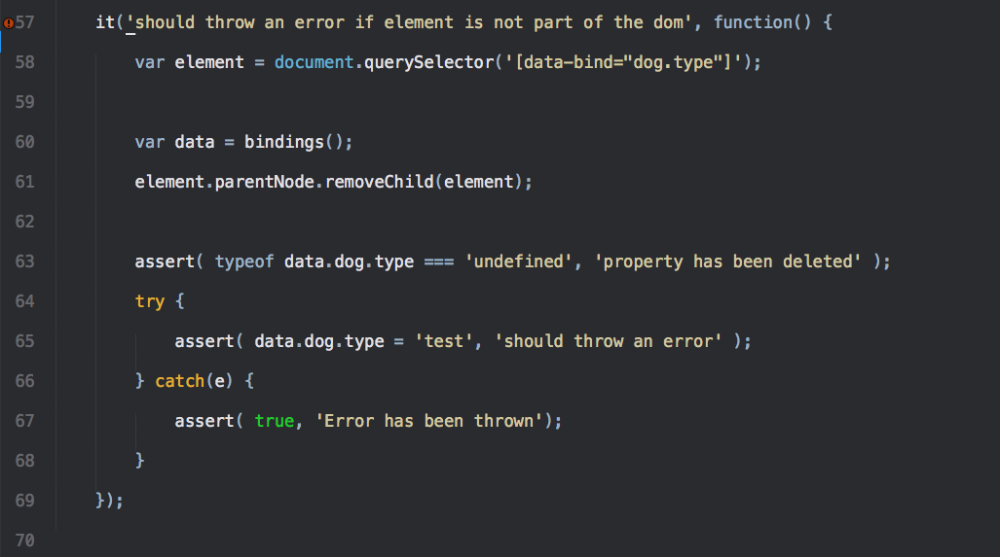
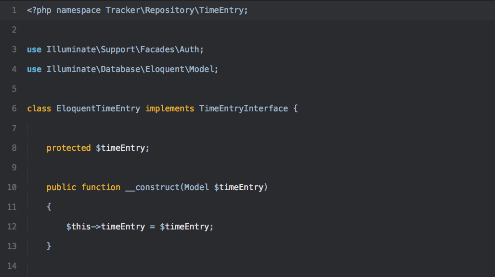
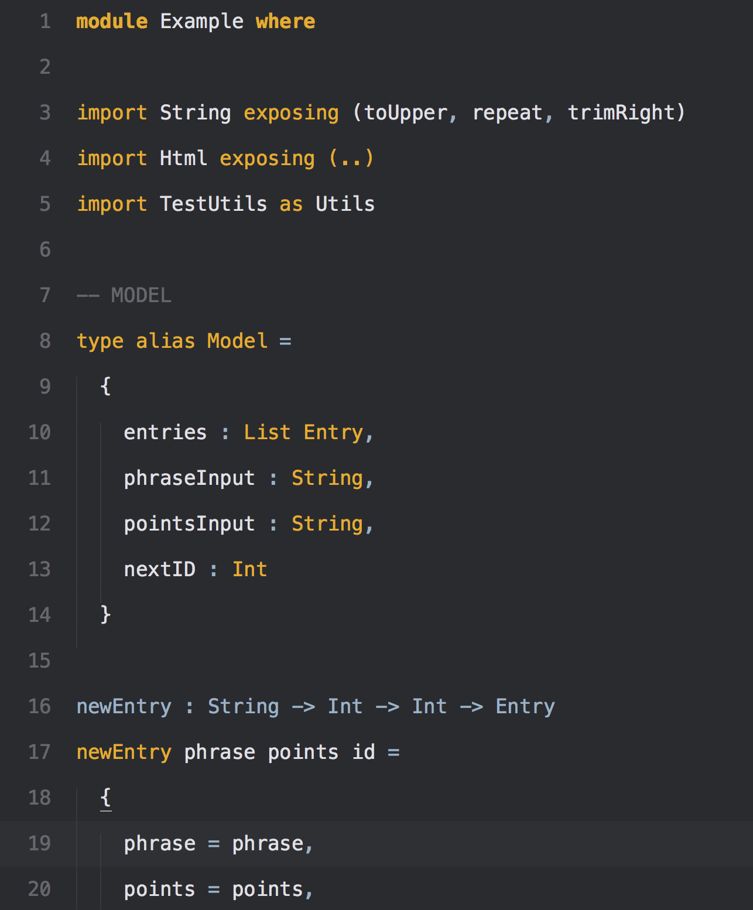
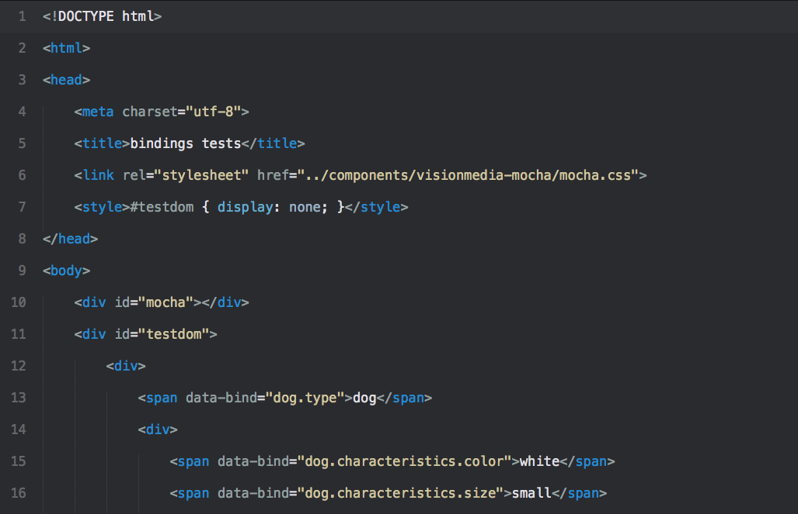
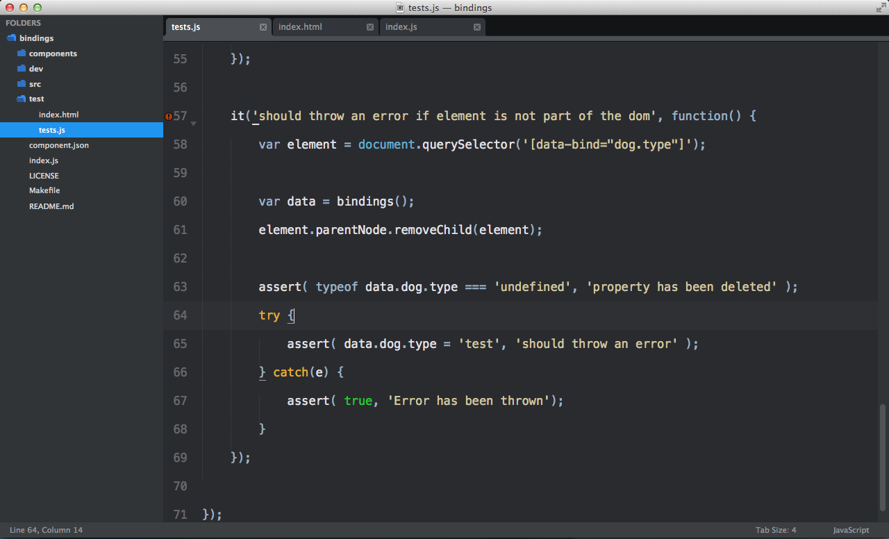

Kellys
======

Color Scheme for Sublime Text inspired by [vim-scripts’s kellys theme for VIM](https://github.com/vim-scripts/kellys).

Supported Languages
-------------------

### Javascript

### PHP

### Elm

### HTML

Looks great with the [Flatland theme](https://github.com/thinkpixellab/flatland):

LICENSE
-------

MIT License
