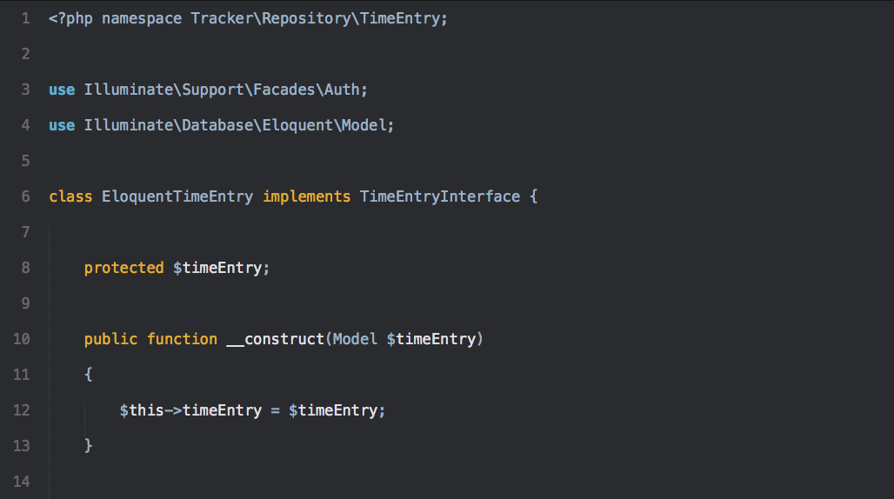

Kellys
======

Color Scheme for Sublime Text inspired by [vim-scripts’s kellys theme for VIM](https://github.com/vim-scripts/kellys).

Screenshots
-----------

Javascript:

PHP:

HTML:

Looks great with the [Flatland theme](https://github.com/thinkpixellab/flatland):

LICENSE
-------

MIT License
